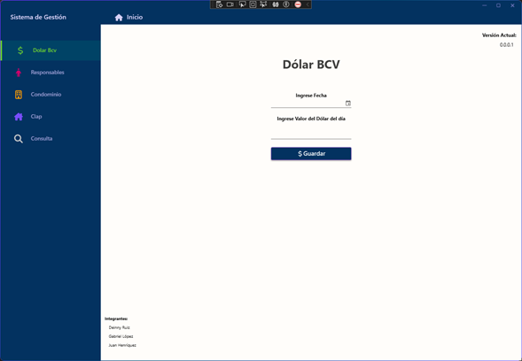

# SISTEMA DE GESTIÓN INTEGRAL DEL CONSEJO COMUNAL ALTAGRACIA (SIGCCA)

Sistema de gestión integral para la comunidad Altagracia en Acción como proyecto de servicio comunitario de los integrantes Deinny Ruiz, Gabriel López y Juan Henriquez

## Módulo BCV

Para ingresar la información de la tasa del día del Banco Central de Venezuela para el cálculo de los pagos

## Módulo Responsable

Para guardar la información del responsable por familia o apartamento

## Módulo Pago Condominio

Para uso de gestión de condominio y registrar el pago de las cuotas del condominio por apartamento

## Módulo Pago Clap

Para uso de gestión del clap y registrar el pago de las bolsas de alimentos y otros beneficios

## Módulo Consulta

Para consultar la información guardada en la base de datos y exportar a excel de ser necesario